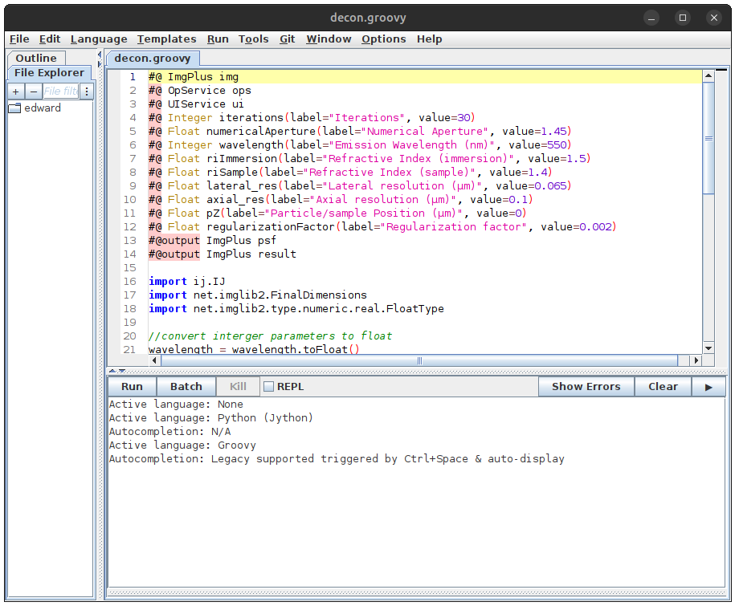

# fiji-scripts

This repository contains various image processing and image analysis scripts written
in languages supported by Fiji (_e.g._ Groovy, Python (Jython), ImageJ Macro, etc...).

# How to run a script in Fiji

To run a script in Fiji, open the _script editor_ with the `[` hotkey or
**New** > **Script...** from the menu. Copy or open a script in the _script editor_
and then click **Run** to execute the script.

# Notes

- Scripts starting with the `ijo` prefix utilize [ImageJ Ops](https://imagej.net/libs/imagej-ops/index)
  to perform the image processing.
    - **ImageJ Ops** ships with Fiji, no additional installation is required.
- Scripts starting with the `sjo` prefix utilize [SciJava Ops](https://ops.scijava.org/en/latest/)
  to perform t he image processing.
    - **SciJava Ops** must be installed first before using scripts that use the `OpEnvironment`.
    - See these instructions on [how to install SciJava Ops](https://ops.scijava.org/en/latest/Installation.html).
